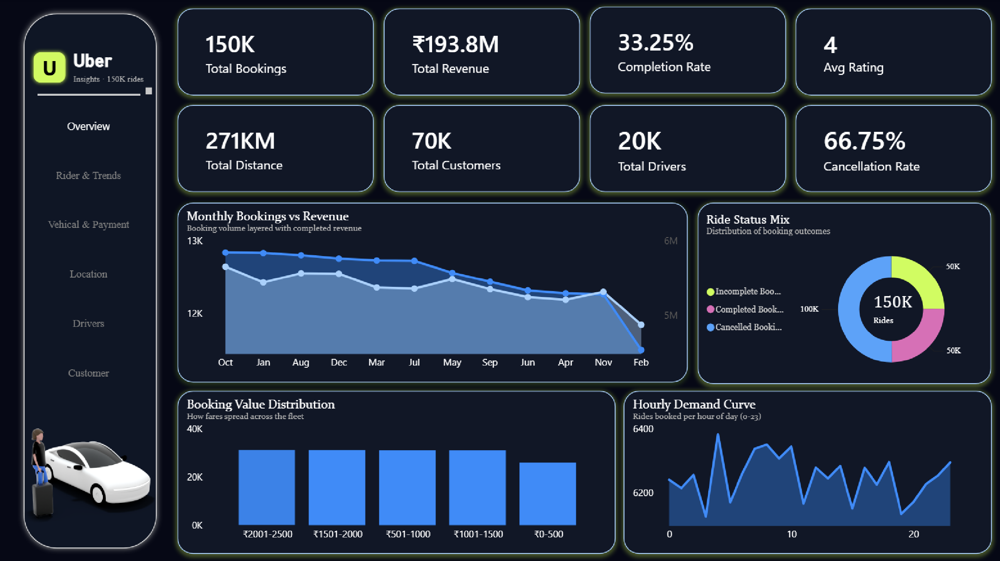
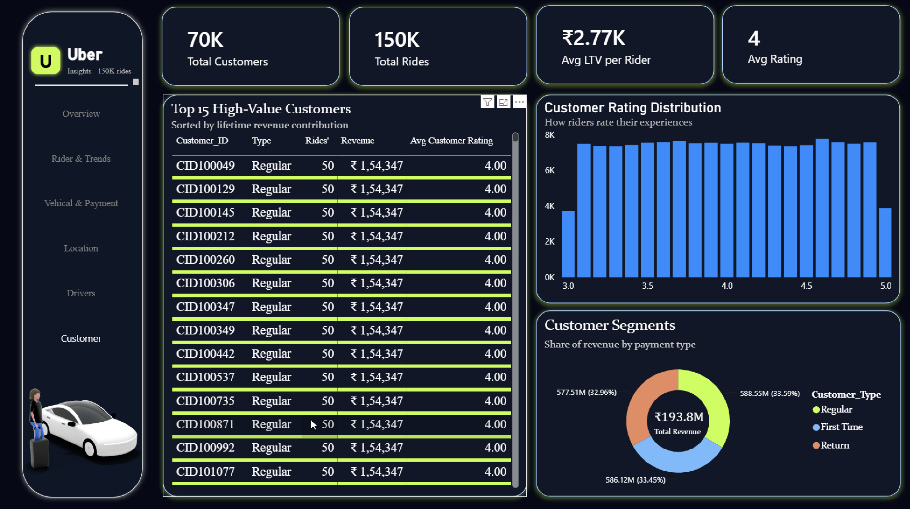
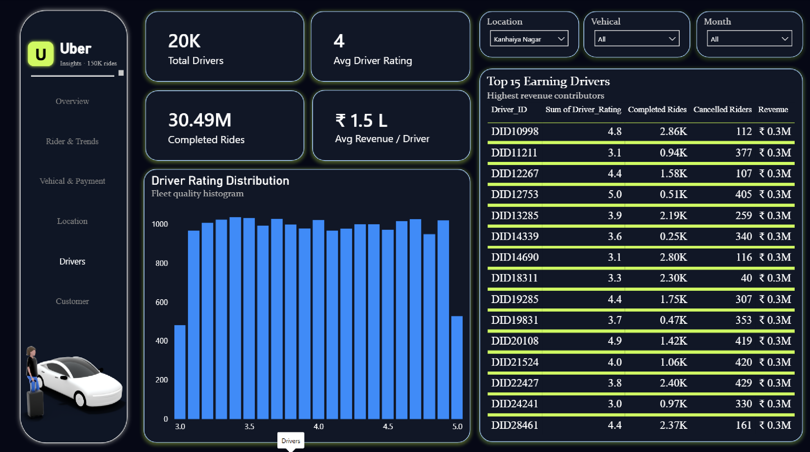
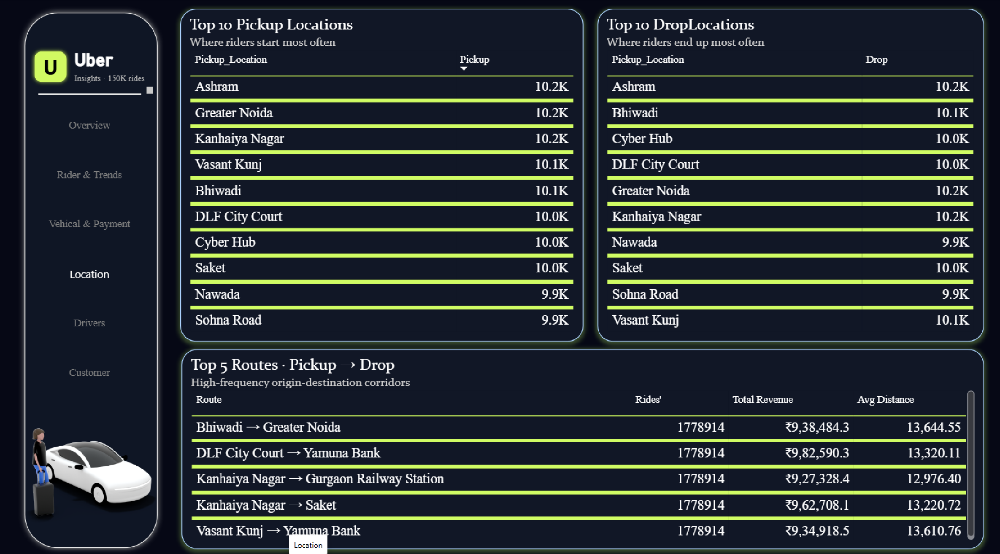
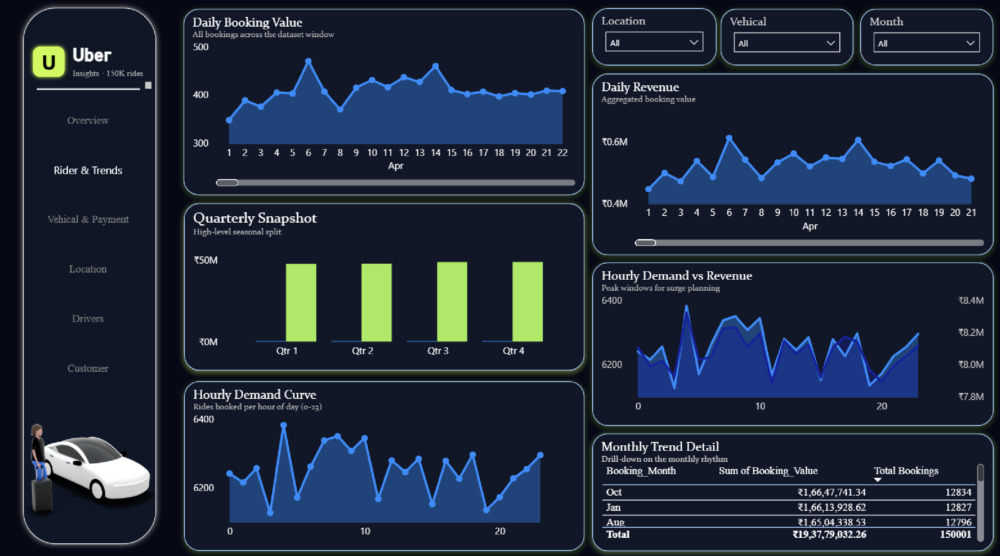
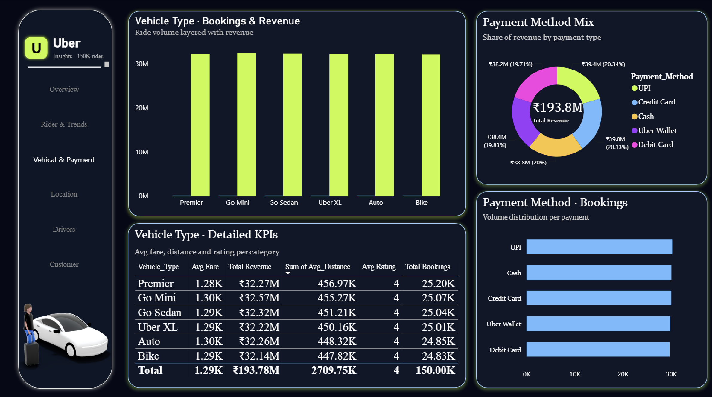

# 🚖 Uber Trip Analysis Dashboard | Power BI Project

## 📌 Project Overview
This project is an interactive **Power BI dashboard** built to analyze Uber trip data and provide insights into booking patterns, revenue generation, trip efficiency, and customer behavior.

The dashboard helps stakeholders understand key business metrics and make data-driven decisions through visually appealing and interactive reports.

---

## 📊 Dashboard Features

- 📈 Total Bookings Analysis
- 💰 Revenue and Fare Analysis
- 🕒 Trip Duration Insights
- 📍 Pickup and Drop-off Location Analysis
- 🚗 Vehicle Category Performance
- 📅 Time-Based Analysis (Daily, Weekly, Monthly Trends)
- ⭐ Customer Ratings and Feedback Analysis
- 🔍 Interactive Filters and Slicers for detailed exploration

---

## 🛠️ Tools & Technologies Used

- **Power BI Desktop**
- **Power Query** for data transformation
- **DAX (Data Analysis Expressions)** for calculations and measures
- **Excel/CSV Dataset**
- **GitHub** for version control and project sharing

---

## 📂 Project Structure

```text
Uber-PowerBI-Dashboard/
│
├── Uber_Full_Data.xlsx
│
├──  Uber.pbix
│
├── Images/
│   ├── Operations Overview.png
│   ├── Rides & Revenue Trends.png
│   ├── Vehicle Types & Payment Mix.png
│   ├── Pickup, Drop & Routes.png
│   ├── Driver Performance.png
│   ├── IntercityComfort.png
│   └── Customer Insights.png
│
└── README.md
```

---

## 📸 Dashboard Preview
(Add screenshot here)

# Main Dashboard



# Customer Insights



# Driver Performance



# Pickup, Drop & Routes



### Rides & Revenue Trends



# Vehicle Types & Payment Mix




---

## 📈 Key Metrics Tracked

- Total Trips
- Total Revenue
- Average Trip Distance
- Average Fare Amount
- Average Trip Duration
- Peak Booking Hours
- Most Popular Pickup Locations
- Vehicle Type Utilization

---

## 🎯 Business Objectives

- Identify peak demand periods.
- Analyze revenue trends and trip performance.
- Understand customer travel patterns.
- Improve operational efficiency through data insights.

---

## 🚀 How to Use

1. Clone this repository:
   ```bash
   git clone https://github.com/priyanshushekhar0077/Uber_Power-BI_Dashboard
   ```

2. Open the `.pbix` file in Power BI Desktop.

3. Refresh the dataset if required.

4. Explore the dashboard using filters and slicers.

---

## 📷 Screenshots

| Dashboard | Description |
|-----------|------------|
| Overview | Summary of all key business metrics. |
| Customer Insights | Analysis of customer behavior and trends. |
| Driver Performance | Insights into driver activity and performance. |
| Pickup, Drop & Routes | Analysis of locations and travel routes. |
| Rides & Revenue Trends | Trends in rides and revenue over time. |
| Vehicle Types & Payment Mix | Distribution of vehicle types and payment methods. |

---

## 🔮 Future Improvements

- Real-time data integration.
- Predictive analytics using Machine Learning.
- Geospatial visualization using maps.
- Customer segmentation analysis.

---

## 👨‍💻 Author

**Priyanshu Shekhar**

- GitHub: https://github.com/priyanshushekhar0077
- LinkedIn: https://linkedin.com/in/priyanshushekhar0077

---

## ⭐ If you found this project useful, consider giving it a star!
